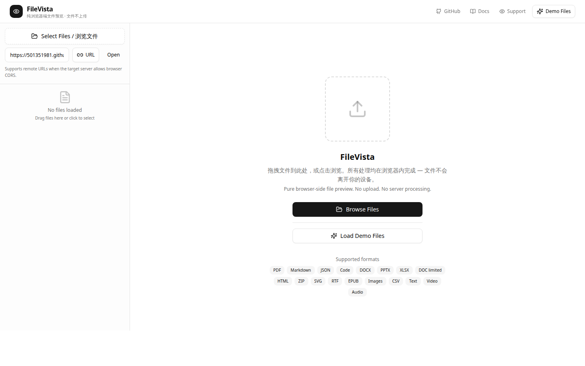

# FileVista

[](https://www.npmjs.com/package/@lamberl-lee/file-preview)
[](https://www.npmjs.com/package/@lamberl-lee/file-preview)
[](https://github.com/CoderLambert/filevista/actions/workflows/ci.yml)
[](LICENSE)

English | [简体中文](README.zh-CN.md)

**A React file viewer for 20+ formats, rendered entirely in the browser with no server uploads.**

Preview PDF, DOCX, PPTX, XLSX, EPUB, RTF, Markdown, source code, images, video, audio, ZIP, CSV, SVG, HTML, and plain text from `File`, `Blob`, `ArrayBuffer`, or remote URLs.

[Live demo](https://coderlambert.github.io/filevista/) · [npm package](https://www.npmjs.com/package/@lamberl-lee/file-preview) · [Quick start](#quick-start) · [Supported formats](packages/file-preview/docs/supported-formats.md) · [Package documentation](packages/file-preview/README.md)



## Why FileVista?

- **One viewer, 20+ formats.** Cover common documents, Office files, code, archives, ebooks, images, audio, and video behind one React API.
- **Files stay on the device.** Rendering happens in the browser; FileVista does not require an upload or conversion server.
- **Pay only for the formats you use.** Base formats stay on the root entry while PDF and Office renderers are opt-in plugins with optional peer dependencies.
- **Works with local and remote sources.** Use `File`, `Blob`, `ArrayBuffer`, or a CORS-enabled URL.
- **Built for real applications.** Includes large-file policies, safe HTML preview, error hooks, theming, and Chinese/English locales.

## Choose your setup

| Setup | Best for | Import |
| --- | --- | --- |
| Base | Markdown, code, HTML, JSON, CSV, SVG, text, images, audio, and video | `@lamberl-lee/file-preview` |
| Full | Base formats plus PDF, DOCX, PPTX, XLSX, RTF, ZIP, and EPUB | `@lamberl-lee/file-preview/full` |
| Individual plugins | Applications that need only selected heavy formats | `@lamberl-lee/file-preview/plugins/*` |

## Quick start

Install the base package:

```bash
npm install @lamberl-lee/file-preview
```

Render a local file with the lightweight base registry:

```tsx
import {
  PluginPreviewRenderer,
  detectFileType,
  type FileInfo,
} from "@lamberl-lee/file-preview";
import "@lamberl-lee/file-preview/styles/index.css";

export function FilePreview({ source }: { source: File }) {
  const file: FileInfo = {
    id: crypto.randomUUID(),
    name: source.name,
    size: source.size,
    type: source.type,
    fileType: detectFileType(source.name, source.type),
    source: { kind: "file", file: source },
  };

  return <PluginPreviewRenderer file={file} />;
}
```

### Add PDF or Office formats

Heavy renderers are optional so they do not inflate every application bundle. Install only the peers you need, then use the full registry or individual plugin exports:

```bash
npm install @lamberl-lee/file-preview pdfjs-dist docx-preview
```

```tsx
import { PluginPreviewRenderer } from "@lamberl-lee/file-preview";
import { createFullPreviewRegistry } from "@lamberl-lee/file-preview/full";

const registry = createFullPreviewRegistry();

<PluginPreviewRenderer file={file} registry={registry} />;
```

PDF and RTF need runtime assets in your public directory. See the [static asset setup](packages/file-preview/README.md#static-assets-pdfjs-worker-rtfjs-bundles) before enabling those formats.

## Supported formats

| Category | Formats |
| --- | --- |
| Documents | PDF, DOCX, PPTX, XLSX, RTF, EPUB |
| Web and data | HTML, Markdown, JSON, CSV, SVG, plain text |
| Source code | JavaScript, TypeScript, Python, Go, and other Shiki languages |
| Media | PNG, JPEG, WebP, GIF, audio, and video |
| Archives | ZIP listing and EPUB package preview |

See the [detailed support matrix](packages/file-preview/docs/supported-formats.md) for rendering limits and browser requirements.

## Common integration issues

| Symptom | What to check |
| --- | --- |
| PDF/Office file is reported as unsupported | Install the relevant optional peer and pass the `/full` or individual plugin registry. |
| PDF worker cannot be loaded | Copy the PDF worker and configure `setAssetBasePath()`. |
| RTF preview cannot start | Copy the RTF.js bundles and configure the same asset base path. |
| Remote URL cannot be previewed | The source server must allow browser CORS requests. |
| Large files are warned, confirmed, or blocked | Configure `largeFilePolicy`, or explicitly set it to `"off"` after handling size limits upstream. |

The [package README](packages/file-preview/README.md) covers optional dependencies, remote URLs, static assets, theming, i18n, custom registries, and browser support.

## Repository layout

- [`packages/file-preview`](packages/file-preview) — the published React library.
- [`apps/playground`](apps/playground) — the Next.js demo deployed to GitHub Pages.
- [`docs`](docs) — architecture notes, support matrices, and contributor documentation.

## Development

Requirements: Node.js 22+, pnpm 11+.

```bash
pnpm install
pnpm run dev
```

Before opening a pull request:

```bash
pnpm run check
```

See [CONTRIBUTING.md](CONTRIBUTING.md) for the complete workflow and [SECURITY.md](SECURITY.md) for private vulnerability reporting.

## License

FileVista is licensed under [LGPL-3.0-or-later](LICENSE). It can be used in proprietary applications; the LGPL obligations apply when distributing a modified version of the library itself.
